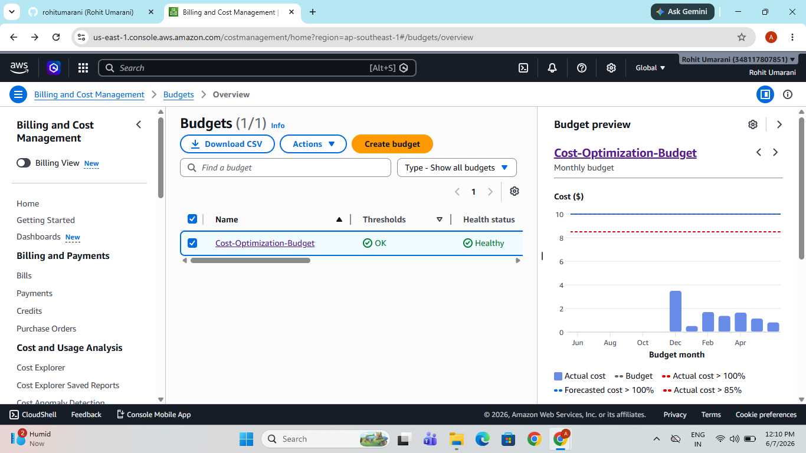
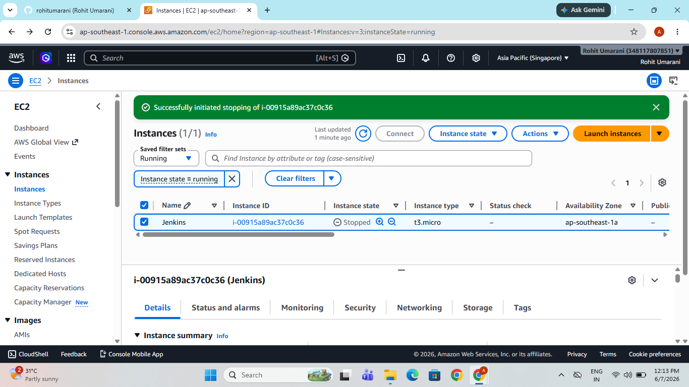
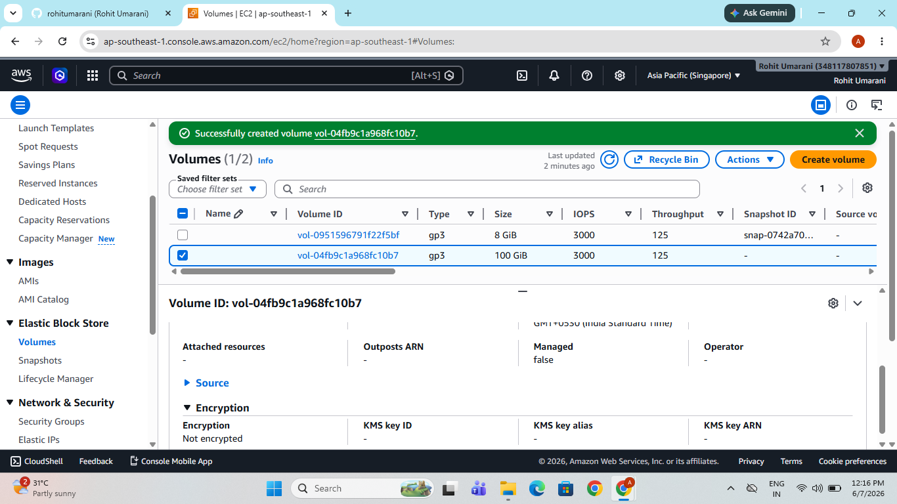
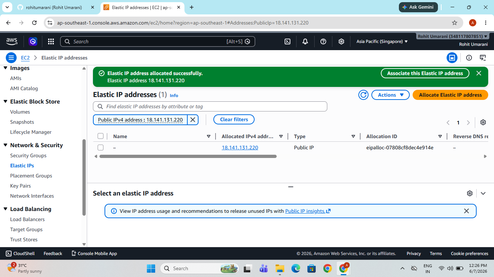
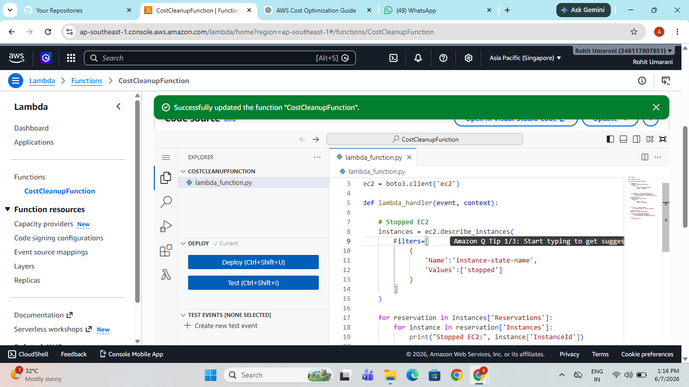
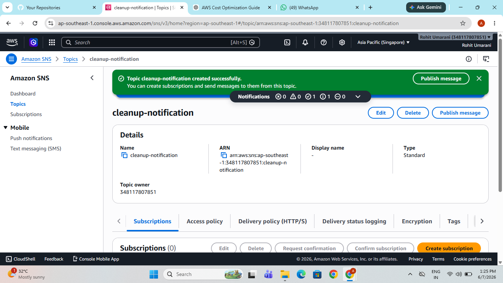
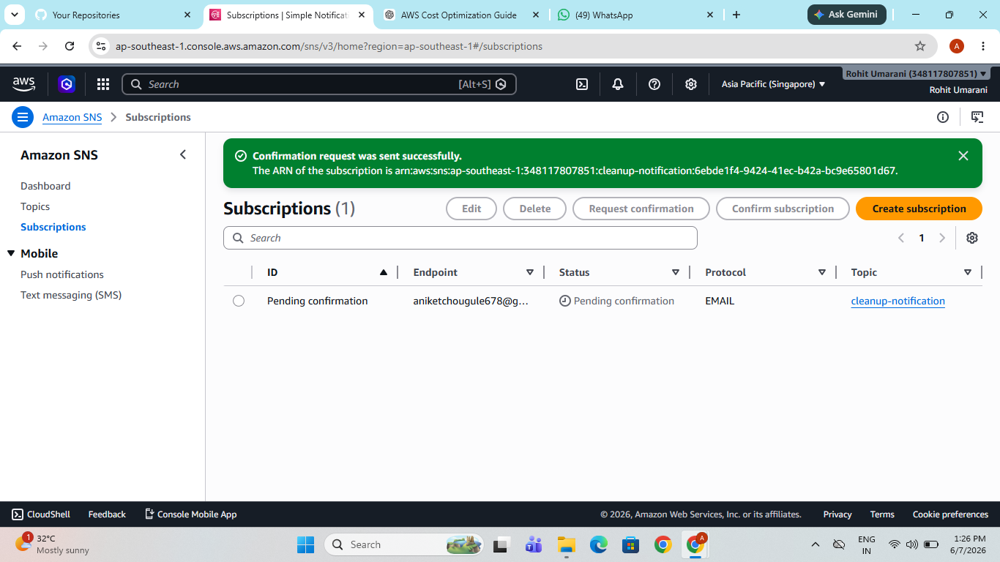
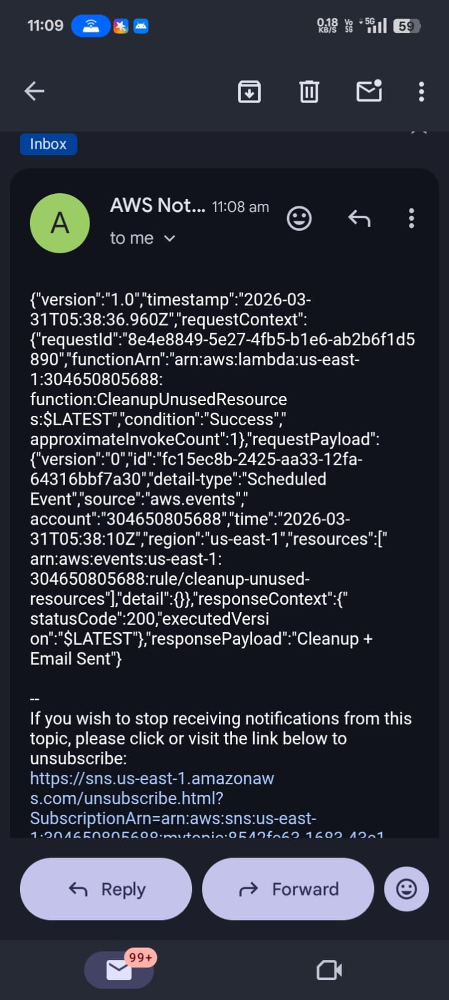

# AWS Cost Optimization using Budgets and Automated Cleanup

## 📌 Project Objective
This project demonstrates how to reduce unnecessary AWS costs by:

- Monitoring AWS spending using AWS Budgets
- Identifying unused resources like stopped EC2 instances, unattached EBS volumes, and unused Elastic IPs
- Automating cleanup using AWS Lambda
- Logging actions using CloudWatch
- Sending notification emails using SNS
---
Architecture Digram :

---

# 🧾 Step 1: Create AWS Budget

To monitor AWS spending and receive alerts when the budget limit is reached.

Steps performed:

1. Login to AWS Console
2. Open AWS Budgets
3. Click **Create Budget**
4. Choose **Cost Budget**
5. Enter budget details:

- Budget Name: `MyAWSCostBudget`
- Period: Monthly
- Budget Amount: `100 USD`

6. Configure alerts

- Alert 1: 80%
- Alert 2: 100%

7. Enter email to receive notifications.

### Screenshot



---

# 🔎 Step 2: Identify Unused AWS Resources

We checked AWS resources that may generate cost even when not in use.

## 1️⃣ Stopped EC2 Instances

Steps:

1. Open EC2 service
2. Go to **Instances**
3. Filter by **Instance State → Stopped**

Stopped instances still may incur storage costs.

### Screenshot


---

## 2️⃣ Unattached EBS Volumes

Steps:

1. EC2 → Volumes
2. Filter **Status → Available**

Available volumes are not attached to any instance and can be deleted.

### Screenshot



---

## 3️⃣ Unused Elastic IPs

Steps:

1. EC2 → Elastic IPs
2. Check **Not Associated**

Unused Elastic IPs generate cost if not attached to any instance.

### Screenshot


---

# ⚙️ Step 3: Automate Cleanup Using Lambda

To automatically clean unused resources we created a Lambda function.

Service used: **AWS Lambda**

Function name:
----
CleanupUnusedResources
```
Runtime:
```
Python 3.11

```

IAM Permissions attached:

- AWSLambdaBasicExecutionRole
- AmazonEC2FullAccess

---

## Lambda Code

```python
import boto3
ec2 = boto3.client('ec2')

# Stop stopped instances
def stop_stopped_instances():
    instances = ec2.describe_instances(
        Filters=[{'Name': 'instance-state-name', 'Values': ['stopped']}]
    )
    for reservation in instances['Reservations']:
        for instance in reservation['Instances']:
            instance_id = instance['InstanceId']
            print(f"Stopping instance: {instance_id}")
            ec2.stop_instances(InstanceIds=[instance_id])

# Delete unattached volumes
def delete_unattached_volumes():
    volumes = ec2.describe_volumes(
        Filters=[{'Name': 'status', 'Values': ['available']}]
    )
    for vol in volumes['Volumes']:
        vol_id = vol['VolumeId']
        print(f"Deleting volume: {vol_id}")
        ec2.delete_volume(VolumeId=vol_id)

def lambda_handler(event, context):
    stop_stopped_instances()
    delete_unattached_volumes()
    return "Cleanup done!"
    
```
----
#### Lambda Execution Screenshot



---

## 📊 Step 4: Reporting and Logging

Lambda execution logs are automatically stored in CloudWatch Logs.

Steps:

Open CloudWatch

Go to Log Groups

Open log group
```

/aws/lambda/CleanupUnusedResources
```
Logs show cleanup actions such as:

Stopping EC2 instances

Deleting unattached EBS volumes


---

## 📧 Optional: Email Notification Using SNS

To receive email alerts for cleanup activity.

Steps:

1) Open SNS (Simple Notification Service)
2) Create topic
3) cleanup-notification
4) Subscribe email
5) Confirm email subscription
6) Publish message from Lambda

Screenshot :



---

## 📊 Cost Optimization Strategy

This project implements the following cost optimization practices:

* Budget monitoring
* Cost alerts via email
* Identifying unused resources
* Automated cleanup using Lambda
* Logging using CloudWatch

screenshot :


---

## 📈 Benefits of this Project

* Prevents unnecessary AWS spending
* Automatically cleans unused resources
* Provides logging and monitoring
* Demonstrates practical AWS DevOps automation

## 🧑‍💻 Author

**Rohit Umarani**
AWS & DevOps Engineer


---

# 📂 Screenshot Folder Structure

```

project-folder
│
├── README.md
│
└── images
│
├── budget.png
├── stopped-instances.png
├── unattached-volumes.png
├── unused-eip.png
├── lambda-test.png
├── cloudwatch-logs.png
└── sns-topic.png
```
